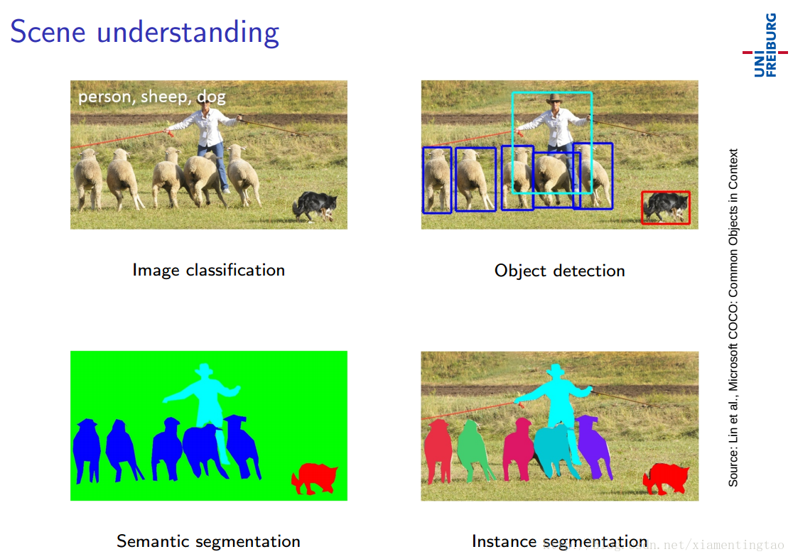
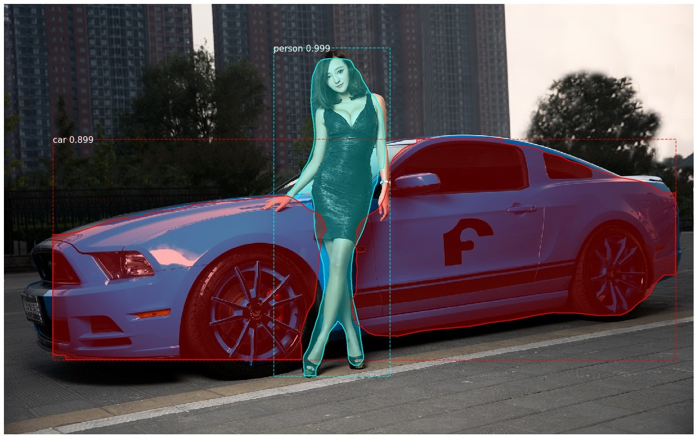
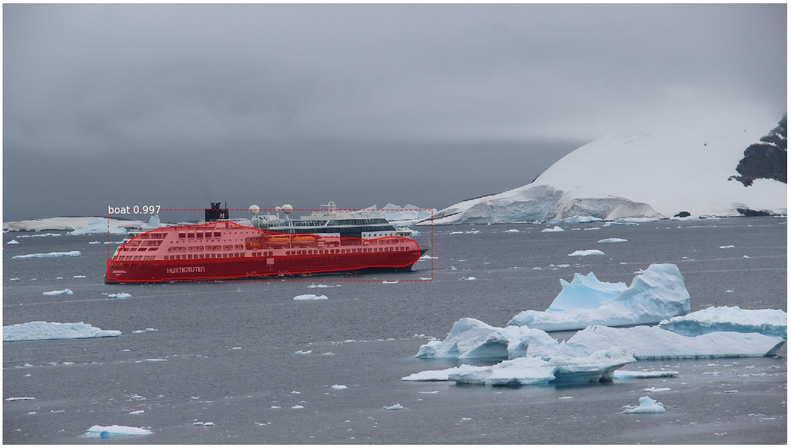

# MaskRCNN

**Mask R-CNN is for  "instance segmentation".** Please reference  https://arxiv.org/abs/1703.06870.




**Example 1**


**Example2** 



## Demo

`python predict.py images/car58a54312d.jpg`


## Training
1.` Put Coco files under data directory.`  

   `data/`  
   `├── annotations`    
   `├── test2014`    
   `├── train2014`  
   `└── val2014`  

2.` ./train.sh`  


## Evaluation

```
./eval.sh

DONE (t=2.57s).
 Average Precision  (AP) @[ IoU=0.50:0.95 | area=   all | maxDets=100 ] = 0.317  
 Average Precision  (AP) @[ IoU=0.50      | area=   all | maxDets=100 ] = 0.525  
 Average Precision  (AP) @[ IoU=0.75      | area=   all | maxDets=100 ] = 0.336  
 Average Precision  (AP) @[ IoU=0.50:0.95 | area= small | maxDets=100 ] = 0.139  
 Average Precision  (AP) @[ IoU=0.50:0.95 | area=medium | maxDets=100 ] = 0.366  
 Average Precision  (AP) @[ IoU=0.50:0.95 | area= large | maxDets=100 ] = 0.492  
 Average Recall     (AR) @[ IoU=0.50:0.95 | area=   all | maxDets=  1 ] = 0.261  
 Average Recall     (AR) @[ IoU=0.50:0.95 | area=   all | maxDets= 10 ] = 0.369  
 Average Recall     (AR) @[ IoU=0.50:0.95 | area=   all | maxDets=100 ] = 0.379  
 Average Recall     (AR) @[ IoU=0.50:0.95 | area= small | maxDets=100 ] = 0.169  
 Average Recall     (AR) @[ IoU=0.50:0.95 | area=medium | maxDets=100 ] = 0.425  
 Average Recall     (AR) @[ IoU=0.50:0.95 | area= large | maxDets=100 ] = 0.562  
Prediction time: 349.81333112716675. Average 0.6996266622543335/image
Total time:  401.12283730506897
```


## Requirements

* Python 3.6.2

* Pytorch 1.0.0

* matplotlib, scipy, scikit-image


## Installation
1. Clone this repository.

        git clone https://github.com/delldu/MaskRCNN.git

2. Download pre-trained model.

　　　Download mask_rcnn_coco.pth from https://pan.baidu.com/s/1HVUdfrFKPMGlMcUP7mXZGw

 and put it under  models .


3. Install c++ extension packages

       cd c++ext  
       make  
       cd ../
       
       cd cocoapi/PythonAPI  
       make  
       cd ../..


## Thanks

1. Mask R-CNN https://arxiv.org/abs/1703.06870

2. https://github.com/multimodallearning/pytorch-mask-rcnn


## Chinese Document

[中文文档](docs/explore.pdf)


